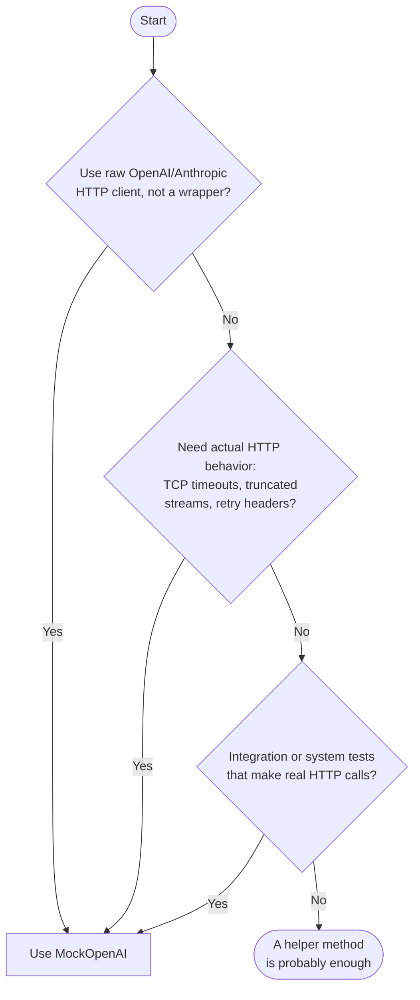

# When not to use MockOpenAI — Implementation Plan

> **For agentic workers:** REQUIRED: Use superpowers:subagent-driven-development (if subagents available) or superpowers:executing-plans to implement this plan. Steps use checkbox (`- [ ]`) syntax for tracking.

**Goal:** Add a top-level "When not to use MockOpenAI" docs page and link to it from the README and the landing page.

**Architecture:** One new Jekyll markdown file at the top level of `docs/`. Mermaid JS loaded via `_includes/head_custom.html` for the decision diagram. Two existing files updated with inbound links.

**Tech Stack:** Jekyll, just-the-docs theme, Mermaid.js (via CDN), Markdown, HTML/Tailwind (landing page)

**Spec:** `docs/specs/2026-03-17-when-not-to-use-design.md`

---

## File map

| Action | File | Purpose |
|--------|------|---------|
| Create | `docs/when-not-to-use.md` | New top-level docs page |
| Modify | `docs/_includes/head_custom.html` | Load Mermaid JS for the diagram |
| Modify | `README.md` | Add inbound link after "Why MockOpenAI?" bullets |
| Modify | `docs/landing/index.html` | Add inbound link at end of "THE PROBLEM" section |

---

## Chunk 1: Docs page and Mermaid diagram

### Task 1: Create the prose content of the docs page

**Files:**
- Create: `docs/when-not-to-use.md`

- [ ] **Step 1: Create the file with frontmatter and prose**

Create `docs/when-not-to-use.md` with the following content (leave a `<!-- DIAGRAM -->` placeholder where the diagram will go in Task 2):

```markdown
---
title: When not to use MockOpenAI
nav_order: 6
---

# When not to use MockOpenAI

MockOpenAI adds the most value in specific circumstances. A simpler in-project
helper method is often the right call, and this page helps you decide which
approach fits your situation.

## When a helper method is enough

A simple helper module is sufficient when:

- **Single high-level library.** The app uses one library (e.g., RubyLLM) that
  wraps all LLM calls. Tests only need happy-path responses and basic exception
  raising. No HTTP layer is involved.
- **Pure unit tests only.** Tests verify logic within a single class. The LLM
  call is one of several dependencies being stubbed. HTTP-layer fidelity
  provides no value.
- **Minimal test dependencies preferred.** Coupling to the library's internal
  API is acceptable, and adding a local server to the test suite is more
  complexity than the project needs.

Here is an example from a real project:

```ruby
module RubyLLMMocks
  def mock_ruby_llm_chat(content: nil, error: nil)
    if error
      allow(RubyLLM).to receive(:chat).and_raise(error)
    else
      mock_response = instance_double(
        RubyLLM::Message,
        content: content,
        inspect: "RubyLLM::Message(content: #{content.inspect})"
      )

      mock_chat_with_schema = instance_double(
        RubyLLM::Chat,
        ask: mock_response
      )

      mock_chat = instance_double(
        RubyLLM::Chat,
        with_schema: mock_chat_with_schema
      )

      allow(RubyLLM).to receive(:chat).and_return(mock_chat)
    end
  end
end
```

This is a real-world example from the [hyrum project](https://github.com/grymoire7/hyrum/blob/main/spec/support/ruby_llm_mocks.rb).

Note the tradeoff: this helper is tightly coupled to RubyLLM's internal API
(`.with_schema`, `.ask`, `RubyLLM::Chat`). It breaks when the library
refactors, but the failure is immediate and easy to fix.

Also note: this approach handles error simulation just fine for wrapper library
users. Passing
`error: RubyLLM::RateLimitError.new(...)` raises the same exception your
application code would see in production. MockOpenAI's failure modes add value when
you need the full HTTP stack exercised: actual TCP delays, mid-stream cutoffs,
or response header parsing. They are not needed for simulating the typed
exceptions a library like RubyLLM already surfaces.

## When MockOpenAI earns its place

Consider MockOpenAI when:

- You use the raw OpenAI or Anthropic HTTP client directly, without a wrapper
  library, or your app uses multiple LLM clients
- You run integration or system tests that make real HTTP connections
- You need to test actual HTTP behavior: TCP-level timeouts, truncated streams,
  or retry-after header parsing (not just exception handling that a wrapper
  library already surfaces)
- You use background jobs or Capybara system tests where object-level mocking
  is awkward or impossible

For full details, see [Getting started](getting-started/).

## How to decide

<!-- Note: the spec does not name this section heading. "How to decide" is a
sensible label for the diagram section — use it as written. -->

<!-- DIAGRAM -->
```

- [ ] **Step 2: Verify the file is syntactically valid Jekyll**

Run:
```bash
cd docs && bundle exec jekyll build 2>&1 | tail -20
```

Expected: build completes without errors. The new page appears in `_site/when-not-to-use/index.html`.

If the build fails, fix any YAML frontmatter or Markdown syntax errors before continuing.

- [ ] **Step 3: Commit**

```bash
git add docs/when-not-to-use.md
git commit -m "docs: add when-not-to-use page (prose, no diagram yet)"
```

---

### Task 2: Add Mermaid diagram

**Files:**
- Modify: `docs/_includes/head_custom.html`
- Modify: `docs/when-not-to-use.md`

Mermaid is not included in just-the-docs by default. The approach here is:
1. Load Mermaid JS via CDN in `head_custom.html`
2. Add a small init script that finds `code.language-mermaid` elements (which is what Jekyll/kramdown produces from ` ```mermaid ` fences) and replaces them with `<div class="mermaid">` blocks
3. Use a standard ` ```mermaid ` fence in the markdown

- [ ] **Step 1: Add Mermaid loading to head_custom.html**

The current file has only CSS styles. Append the following after the closing `</style>` tag:

```html
<script src="https://cdn.jsdelivr.net/npm/mermaid@10/dist/mermaid.min.js"></script>
<script>
  document.addEventListener('DOMContentLoaded', function() {
    mermaid.initialize({ startOnLoad: false, theme: 'default' });
    document.querySelectorAll('code.language-mermaid').forEach(function(el) {
      var div = document.createElement('div');
      div.className = 'mermaid';
      div.textContent = el.textContent;
      el.parentElement.replaceWith(div);
    });
    mermaid.run();
  });
</script>
```

- [ ] **Step 2: Replace the diagram placeholder in when-not-to-use.md**

Replace the `<!-- DIAGRAM -->` comment with:

````markdown

````

- [ ] **Step 3: Build and check the diagram renders**

```bash
cd docs && bundle exec jekyll serve --port 4001
```

Open `http://localhost:4001/mockopenai/when-not-to-use/` in a browser.

Expected: the flowchart renders as a visual diagram (not as a code block of
plain text).

Each of the following counts as one attempt:
- Changing the Mermaid CDN URL or version
- Adjusting the JS initialization (e.g., `startOnLoad`, selector, `mermaid.run()`)
- Changing the diagram syntax

If the diagram has not rendered correctly after 3 attempts, stop and fall back
to a comparison table. Remove the `<!-- DIAGRAM -->` placeholder (or the
mermaid fence if it was already added) and replace it with:

```markdown
| Factor | Helper method | MockOpenAI |
|--------|--------------|------------|
| Use raw HTTP client (no wrapper library) | Not suitable | Use this |
| Need TCP timeouts, truncated streams, or retry header parsing | Not suitable | Use this |
| Integration or system tests with real HTTP calls | Awkward | Use this |
```

- [ ] **Step 4: Commit**

```bash
git add docs/_includes/head_custom.html docs/when-not-to-use.md
git commit -m "docs: add mermaid decision diagram to when-not-to-use page"
```

---

## Chunk 2: README and landing page links

### Task 3: Add link to README

**Files:**
- Modify: `README.md`

- [ ] **Step 1: Locate the insertion point**

Open `README.md`. Find the "Why MockOpenAI?" section. It ends with (note the
blank line between the last bullet and `---`):

```markdown
- **OpenAI + Anthropic**: supports `POST /v1/chat/completions` and `POST /v1/messages`

---
```

The blank line already exists — do not add an extra one above the new sentence.

- [ ] **Step 2: Insert the new sentence**

Add a blank line, the new sentence, and another blank line between the last
bullet and the `---` divider:

```markdown
- **OpenAI + Anthropic**: supports `POST /v1/chat/completions` and `POST /v1/messages`

Not sure if MockOpenAI is right for your project? See [When not to use MockOpenAI](https://grymoire7.github.io/mockopenai/when-not-to-use/).

---
```

- [ ] **Step 3: Verify**

Open `README.md` and confirm:
- The new sentence appears between the last bullet and the `---`
- There is a blank line above and below the sentence
- The link URL uses the full GitHub Pages URL

- [ ] **Step 4: Commit**

```bash
git add README.md
git commit -m "docs: link to when-not-to-use from README"
```

---

### Task 4: Add link to landing page

**Files:**
- Modify: `docs/landing/index.html`

The landing page is a standalone HTML file excluded from Jekyll. All links to
docs pages must use absolute URLs.

- [ ] **Step 1: Locate the insertion point**

Open `docs/landing/index.html`. Find the end of "THE PROBLEM" section (~line 387).
The target location looks like:

```html
      </div>               <!-- closing </div> of the two-column comparison grid wrapper -->
                           <!-- INSERT HERE -->
    </div>                 <!-- closing </div> of max-w-6xl container -->
  </section>
```

- [ ] **Step 2: Insert the new paragraph**

```html
      </div>

      <p class="reveal text-center text-slate-500 text-xs mt-10">
        Not sure if MockOpenAI is right for your project?
        <a href="https://grymoire7.github.io/mockopenai/when-not-to-use/" class="text-electric-400 hover:text-electric-300 transition-colors">When not to use MockOpenAI</a>.
      </p>

    </div>
  </section>
```

- [ ] **Step 3: Verify**

Open `docs/landing/index.html` directly in a browser as a local file. The
landing page is excluded from Jekyll and will not be served by
`bundle exec jekyll serve` — open it with `open docs/landing/index.html` or
the equivalent for your OS.

Confirm:
- The sentence appears below the comparison table in "THE PROBLEM" section
- The link text is "When not to use MockOpenAI"
- The link is styled in electric blue consistent with the page design

- [ ] **Step 4: Commit**

```bash
git add docs/landing/index.html
git commit -m "docs: link to when-not-to-use from landing page"
```
