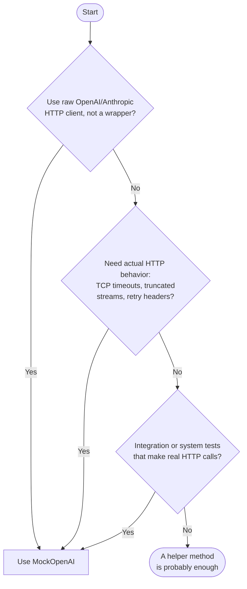

# When not to use MockOpenAI

MockOpenAI adds the most value in specific circumstances. A simpler in-project
helper method is often the right call, and this page helps you decide which
approach fits your situation.

## When a helper method is enough

A simple helper module is sufficient when:

- **Single high-level library.** The app uses one library (e.g., RubyLLM) that
  wraps all LLM calls. Tests only need happy-path responses and basic exception
  raising. No HTTP layer is involved.
- **Pure unit tests only.** Tests verify logic within a single class. The LLM
  call is one of several dependencies being stubbed. HTTP-layer fidelity
  provides no value.
- **Minimal test dependencies preferred.** Coupling to the library's internal
  API is acceptable, and adding a local server to the test suite is more
  complexity than the project needs.

Here is an example from a real project:

```ruby
module RubyLLMMocks
  def mock_ruby_llm_chat(content: nil, error: nil)
    if error
      allow(RubyLLM).to receive(:chat).and_raise(error)
    else
      mock_response = instance_double(
        RubyLLM::Message,
        content: content,
        inspect: "RubyLLM::Message(content: #{content.inspect})"
      )

      mock_chat_with_schema = instance_double(
        RubyLLM::Chat,
        ask: mock_response
      )

      mock_chat = instance_double(
        RubyLLM::Chat,
        with_schema: mock_chat_with_schema
      )

      allow(RubyLLM).to receive(:chat).and_return(mock_chat)
    end
  end
end
```

This is a real-world example from the [hyrum project](https://github.com/grymoire7/hyrum/blob/main/spec/support/ruby_llm_mocks.rb).

Note the tradeoff: this helper is tightly coupled to RubyLLM's internal API
(`.with_schema`, `.ask`, `RubyLLM::Chat`). It breaks when the library
refactors, but the failure is immediate and easy to fix.

Also note: this approach handles error simulation just fine for wrapper library
users. Passing
`error: RubyLLM::RateLimitError.new(...)` raises the same exception your
application code would see in production. MockOpenAI's failure modes add value when
you need the full HTTP stack exercised: actual TCP delays, mid-stream cutoffs,
or response header parsing. They are not needed for simulating the typed
exceptions a library like RubyLLM already surfaces.

## When MockOpenAI earns its place

Consider MockOpenAI when:

- You use the raw OpenAI or Anthropic HTTP client directly, without a wrapper
  library, or your app uses multiple LLM clients
- You run integration or system tests that make real HTTP connections
- You need to test actual HTTP behavior: TCP-level timeouts, truncated streams,
  or retry-after header parsing (not just exception handling that a wrapper
  library already surfaces)
- You use background jobs or Capybara system tests where object-level mocking
  is awkward or impossible

For full details, see [Getting started](getting-started/).

## How to decide

<!-- Note: the spec does not name this section heading. "How to decide" is a
sensible label for the diagram section — use it as written. -->


